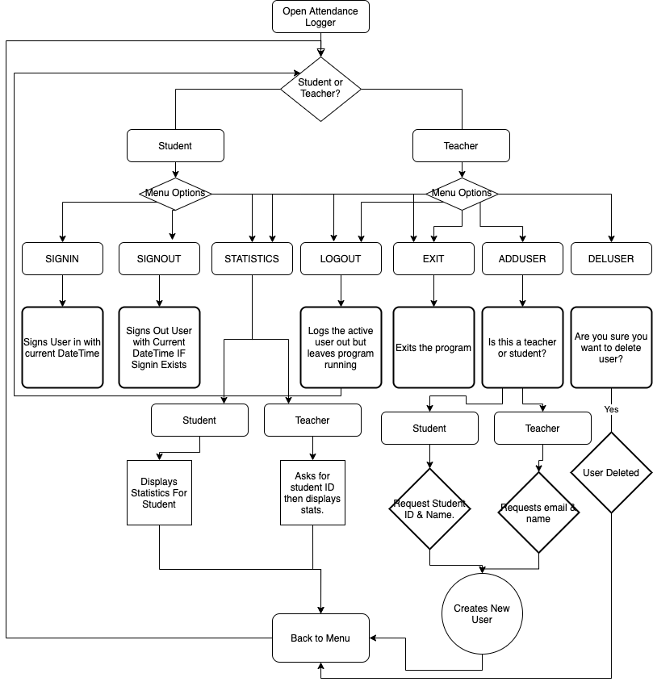

# Attendance Logger! Useful Application to record and retrieve students class attendance!

To use this software please enter the following commands into your terminal.

Nb. You must have Ruby installed before attempting to run this application.

For Mac Installation:

    sh -c "$(curl -fsSL https://raw.githubusercontent.com/richiehubbardau/AttendanceLogger/master/install-mac.sh)"

On first run, application will create a new database and a default user: admin/password

After initial install from src directory please run

    ruby main.rb

Once logged in, you will be guided to the different sections, you must at first login as a teacher to be able to create students.

A local database will be created in the root directory called database.db

# Software Development Plan - Attendance Log

## Statement of Purpose

In a world where plastic straws are evil and you now have too *cut* up your lunch with wooden sporks, it is about time we start to take a look around our offices, classrooms & kitchens (I'm looking at you paper plates!) and seeing if we can find digital solutions to replace these manual tasks, think of the forests - And not to mention all the unnecessary admin work to duplicate this into an electronic system.

With my eco-warrior cloak & digitizing stare, I look around the classroom, there's a daily task which both annoys me & confuses me, the attendance log is still on paper!

The solution is easy, a program must be written which will allow students to log their attendance digitally, that will allow the staff to view each students attendance and check the frequency on which they have been attending class.

## How will this change the everyday lives of students & teachers?

Each day as students attend class, they will be able too use their student ID too login to their systems & mark themselves as attended.

A student will be able to check their attendance & retrieve statistics about how often they have attended their classes.

As all students are now fellow eco-warriors, they will have this warm fuzzy feeling each day knowing that after 6 months, they have potentially saved a tree (branch)

Admin/Teachers will be able to monitor attendance, having the ability to change days, time & add/remove students from the course. While they may still be climate change deniers, they won't be able to deny how much easier a system, that requires them to do less work is!

Admins will be able to edit the default config, advising what days are included in the semester and remove any public holidays.

This will all be published to a LOCAL or REMOTE database depending on the configuration file.

## Features

These features are split between the admin users (Teachers) and the Students. While Students may have access to some features, such as retrieving statistics in regards to their attendance, they will only be able to see this information for themselves.

### Login System

The first feature is the most important, that is an authentication system which will give security around being able to modify records.

Examples: 

* Only a teacher should be able to add and remove students.
* Only a student should be able to sign in & out for attendance
* Both a student and teacher should be able to view attendance, but only the teacher should be able to view everyone
* A student shouldn't be able to modify their attendance record

This login system will utilise a database where the username and passwords will be stored, the passwords are currently stored in plain text and in a local database.

Going forward a remote database would be created and a password hash used for better security.

The login system will reject a user if the password is typed incorrectly more than 5 times

The login system adds security to the application and allows different interactions based on the users role

### Local Database

The terminal application utilises a local SQLite3 DB which is stored in the root directory of the application and accessed using the <sequal> gem which is a sql wrapper which allows easier interaction between multiple databases without the need to make coding changes should the database be changed.

Upon starting of the application for the first time, the database is setup and a default admin user is created along with any configuration settings.

The database is used so the data is persistent and can be retrieved each time the application is run

#### Add New User / Remove User / Disable User - Teacher Only

Once a teacher has logged into the system they will be given menu options to control the application

Only teachers will have the ability to add and remove users from the local database.

When a new user is being created, the following information is required which is stored following prompts from the terminal
This will allow the creation of new users inside the local database, you will be required to supply the following information:

* Name
* Role Student/Teacher

If Student:
* Student ID

If Teacher:

* Email Address

A teacher will be able to disable a student which will remove their ability to login & delete to remove all of the students data.

When a user logs in for the first time they will be required to change their password for security reasons, currently there isn't a way to reset this password should they forget it

#### Show Attendance Statistics - Both Student & Teacher

Students & Teachers will have the abliity to see their attendance records.

While a student can only recall their own records a teacher has the ability to recall any individual student records

This will show all days attended and what time the student/students logged in & the duration they attended for the day.

Going forward, a student and teacher will be able to see their attendance percentage, by utilizing a yet-to-be created module to retrive school days, removing any public holidays & weekends from its calculations.

The statistics will be shown by calling all attendance logs for the student from the SQLite Database and printing each day to the screen.
 
 #### Force Sign-in/Modify Current Sign-ins 
 
 A teacher will be able to backdate previous sign-ins, along with changing existing ones if any errors are found.
 They will also be able too approve any outstanding sign-ins from students that require a manual authorisation.
 
## User Interaction

Users will be guided through an onscreen display for the menu options on which they are available to access.

This will start with a login screen, where they can select either a teacher or student.

Once the role has been selected, the required login details are requested on screen and the user needs to enter a correct username & password to be granted access to the system.

Once authenticated a menu is displayed with all options that the user has access too.

Teacher has the following options:

1. ADDUSER

This will take them through an onscreen walkthrough for creating a new user, they can select either teacher or student that they are creating and will be required to supply the correct information for each user.

A duplicate user check is done to ensure a student/teacher isn't entered into the system more than once - an error is returned and moved back to the menu if this is the case.

For teacher, the email is checked via an in-built method to ensure that it contains a valid email address & for the student the student ID is checked to ensure that it is a valid Integer, should these tests fail they are asked to supply new details.

2. DELUSER

This will allow them to go through and select a valid user, it will check to see if they want to just disable the user, or delete the user and associated logins.

A confirmation screen before deleting will require the user to type delete + student number/admin email

The Student Menu will have the following options:

1. SIGNIN

This will automatically sign the student in for the day, at this exact time and create a new entry in the local database for the day.

A student will be able to login only once for the day, if they try a second time an error will show that they have already logged in and with the time that they logged in.

The times will use the inbuilt DateTime function & will use local machine time.

2. SIGNOUT

This will find the entry for the day, if it exists and add a sign out time which is current to when the user selected signout.

A student can signout multiple times each time changing the signout time to when they leave.

An error will occur if there is no signin found for the day and displayed to the screen.

For both user types, the following command is available:

3. STATISTICS

For a user this will display their current login/logout statistics for each day, recalling them from the database and displaying them directly in the terminal.

If a teacher requests statistics, it is required to then enter the students ID in order to be able to fetch that students results.

4. LOGOUT

All users will have a logout option, this is so the terminal can stay active and another user will have the ability to sign out.

When signed out, variables reset and login credentials are required in order to proceed.

5. EXIT

Should the user be finished with the terminal app, this will safely exit.

## Gems Used in this package

[sqlite3](https://rubygems.org/gems/sqlite3/versions/1.3.11) - This gem allows us to connect to an SQLite DB

[Sequel](https://github.com/jeremyevans/sequel) - This is a gem which allows easy manipulation of the sql database without the need of injecting SQL code. This gem would allow the same code to be used and connect to multiple databases, but for the purpose of this application it is connected to a local SQLite3 Database.

[terminal-table](https://github.com/tj/terminal-table) - This is used to create an ascii table for the statistics.

[whirly](https://rubygems.org/gems/whirly) - This Gem has been used to add a waiting icon when messages are returned

## Design & Implementation

The idea for this project came from forgetting to sign into the class each day that I was in attendance & to try and remove the need for paper.

I've designed this with ease of use in mind, so that the end user can easily login and mark themselves as attended.

While designing, all features have been added to my trello board [here](https://trello.com/b/TwTf35Ys/attendance-logger) and have tasks have been marked off as completed.

The implementation was done by splitting each section up into different functions for each menu, allowing the login system to effectively moderate what each role has the ability to complete.

This has allowed for a neat code system, all ran from a single file while menu options can be easily changed & modified in the relevant class/module.

At any time an error is raised, this is displayed on the screen and showed back to the user.

A flowchart was created, to easily see the design process and to ensure that all options have been covered and coded. 
 

As you can see it can easily be opened, ran and closed quickly for those students who are using the software for its intended purpose, while also giving the admin configuration options to easily add new students into  the database.

I've chosen a local database due to hosting difficulties, for a professional installation a remote hosting facility would be used and a postgres database recommended.

## File Structure

<pre>└── RichardHubbard_T1A2
         ├── README.md
         ├── docs
         │   ├── flow-chart.png
         ├── install-mac.sh
         ├── ppt
         │   └── AttendanceLogger.pptx
         └── src
             ├── Gemfile
             ├── classes
             │   ├── log.rb
             │   └── user.rb
             ├── main.rb
             └── modules
                 ├── database.rb
                 ├── helpers.rb
                 ├── loops.rb
                 └── menu.rb</pre>